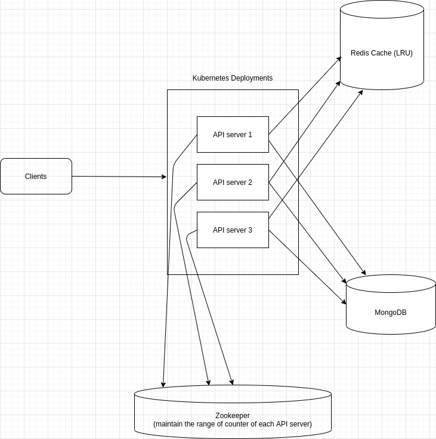
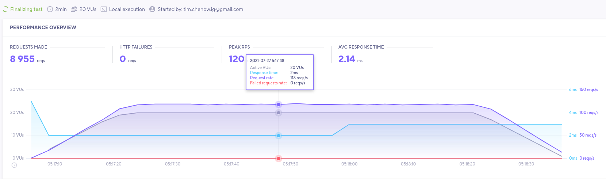

# Tiny URL

This is tiny url writen with golang, redis, mongodb and zookeeper and I deploy it on rancher kubernetes and also build CI/CD pipeline on my self-hosted gitlab.

## API
```
GET <ip>:<port(default: 8080)>/<shortname>
```
```
POST <ip>:<port(default: 8080)>/add

header: application/json
body: {
	"url": "your url"
}
```

## Design
I design this system aim to have 100 URL requents per second, So the shorten name will have **7** characters and generated by use [MD5](https://www.wikiwand.com/en/MD5).  
First, got a range of number from Zookeeper, and then use that number to generate the MD5 value, this method can guarantee the hash code won't collision. Second, take the first **7** characters as short name, you need to check whether this short name is existing in the database. Third, store into database and redis cache.
For get long URL, find in redis cache first. if not found, find in the database.

## System architecture


## Load Testing
The load testing is tested by [k6](https://k6.io/)


## Throuble I encoutered
1. Although I check the short name collision, I still got a lot of collision. Then I found it is the api server problem. A client send request to api server, server will create a thread to handle that request, and use the counter number to compute the hash value. What if 2 thread use counter value simultaneously ? They will use same value to compute short name, and that short name doesn't in database ! So I make a mutex lock on counter variable.